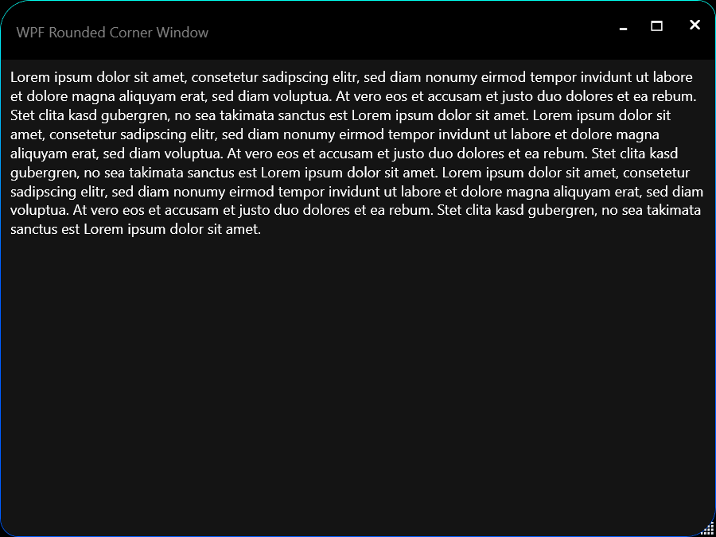
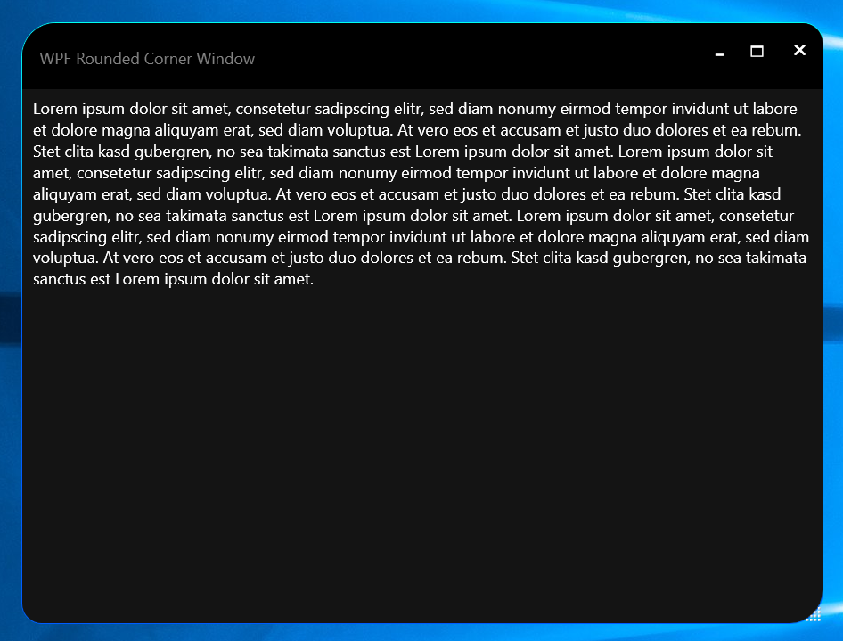

# WPF Rounded Corner Window (sizeable) (WPF abgerundete Fensterecken (änderbare Größe))
For / Für Visual C# &amp; Visual Basic

<h2>Pictures / Bilder</h2>
</a>
</a>
<h2>Download</h2>
<a href="https://github.com/Paderman/WPF_Rounded_corner_window/archive/master.zip"> Project Files / Projektdateien</a> (for/für VS 2017)
